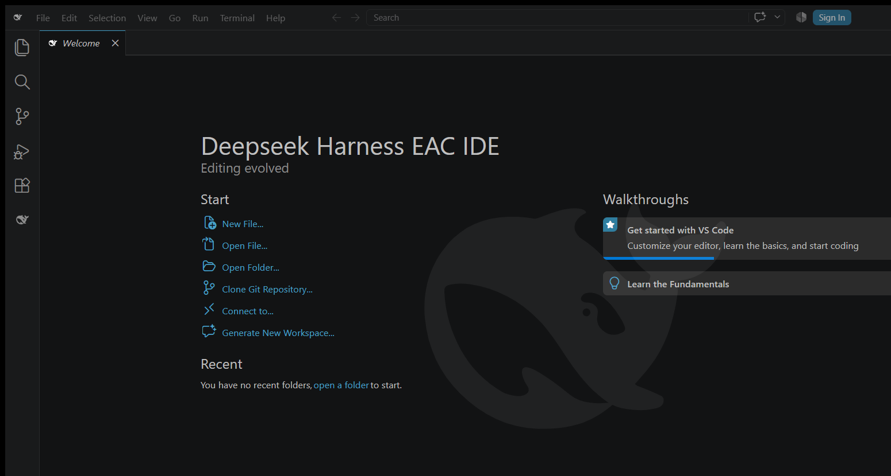
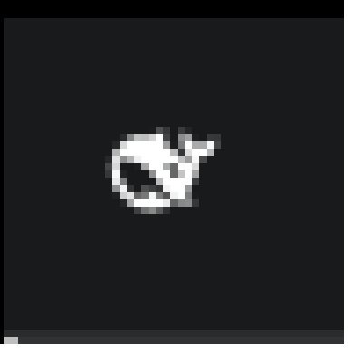

<div align="center">

<h1>Deepseek Harness EAC IDE</h1>

<p><strong>内置 DeepSeek Harness EAC 的独立 IDE —— VS Code 底座 · 万物皆插件 · 开箱即用</strong></p>

<p>
<a href="https://github.com/Ebony-Vinyl/Deepseek-Harness-EAC-IDE/releases"></a>
<a href="https://github.com/Ebony-Vinyl/Deepseek-Harness-EAC-IDE/releases"></a>
<a href="https://github.com/Ebony-Vinyl/Deepseek-Harness-EAC/blob/main/LICENSE"></a>
</p>

<p>类似 Trae / Cursor 的产品形态：基于 VS Code 1.134 fork 底座，把
<a href="https://github.com/Ebony-Vinyl/Deepseek-Harness-EAC">Deepseek Harness EAC</a>
（一切皆插件的 agent harness 桌面版）的扩展与完整运行时<strong>内置</strong>进独立 IDE——
启动即用、无需装扩展，鲸鱼品牌贯穿标题栏到欢迎页。</p>

<p><a href="docs/screenshot-welcome.png"></a></p>
<p><a href="docs/screenshot-titlebar-icon.png"></a></p>

</div>

---

## 下载

前往 [**Releases**](https://github.com/Ebony-Vinyl/Deepseek-Harness-EAC-IDE/releases)：

| 文件 | 说明 |
|---|---|
| `Deepseek-Harness-EAC-IDE-Setup-x64.exe` | NSIS 安装器（推荐，含卸载器） |
| `Deepseek-Harness-EAC-IDE.zip` | 免安装绿色版，解压即用 |

> 两种发行物内容一致，任选其一。系统要求：Windows 10/11 x64。

## 特性

- **独立 IDE 形态**：exe 为 `Deepseek Harness EAC IDE.exe`，任务栏 / 资源管理器 / 标题栏均为鲸鱼图标，与日常 VS Code 互不干扰
- **dsh-eac 内置扩展**：随底座启动、无需安装——内置插件同步（万物皆插件）、cordis.patch.yml 幂等注册、dsh web 服务全链路
- **全品牌 product.json**：nameShort / nameLong / 数据目录 / 互斥体独立，可与 VS Code、桌面版共存
- **欢迎页鲸鱼虚影水印**：居中 6% 透明度，浅色主题自动反色
- **完整验证矩阵**：仓库根测试 286/286 · 扩展单测 60/60 · IDE E2E（扩展激活 / 命令注册 / 内置插件同步 / dsh web 服务 / 重启恢复）· 扩展集成测试

## 上手

1. 安装（或解压）后启动 `Deepseek Harness EAC IDE`；
2. 活动栏点击 **DSH EAC** 打开内置插件面板，或直接开写代码；
3. 所有 dsh 能力（内置插件、市场、余额、皮肤……）与桌面版一致，数据目录独立。

## 源码与构建

本仓库是 **IDE 的发布与文档仓库**；IDE 的组装脚本与扩展源码位于主仓库
[`vscode` 分支](https://github.com/Ebony-Vinyl/Deepseek-Harness-EAC/tree/vscode)：

```bash
git clone -b vscode https://github.com/Ebony-Vinyl/Deepseek-Harness-EAC.git
cd Deepseek-Harness-EAC
npm run ide            # 组装 dist-ide/（底座：IDE_BASE_ZIP 环境变量或第一个参数传 zip/目录）
npm run ide:installer  # NSIS 安装器（需 7za + NSIS）
npm run verify:ide     # IDE 端到端验证
```

## 许可证

[MIT](LICENSE) © 2026 Ebony-Vinyl
